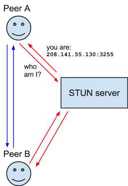
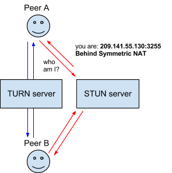

# Peer Connection with WebSockets
Dans ce troisième tutoriel il s'agit, comme précédemment, d'établir la connexion entre deux pairs, afin de faire communiquer des navigateurs en P2P en temps-réel, mais cette fois-ci en reposant sur les WebSockets comme canal de signalisation et non plus sur des "méthodes fictives".

Pour réaliser cela nous devons commencer par mettre en place un serveur NodeJS.

Note importante : Nous devons mettre en place un serveur **HTTPS**. Car l'utilisation de WebRTC doit se faire dans un contexte sécurisé. Ainsi nous commencerons par montrer comment mettre en place un serveur HTTPS.
> A savoir que la connexion *localhost* est considérée comme étant un contexte sécurisé.

<details>
<summary> Prérequis : installation de NodeJS </summary>
Installation des librairies NodeJS avec *npm* suivantes :

**express**
```sh
npm install -S express
```

**socket.io**
```sh
npm install -S socket.io
```
</details>

## 1. Serveur HTTPS avec NodeJS
Nous utiliserons des clés "self-signed" (l'idéal étant d'avoir des clés signés par une autorité...).
Il faut commencer par générer les clés publiques et privées, avec *openssl*.  
Pour plus de détails sur les options sur [linuxize](https://linuxize.com/post/creating-a-self-signed-ssl-certificate/)
```bash
openssl req -newkey rsa:4096 \
            -x509 \
            -sha256 \
            -days 3650 \
            -nodes \
            -out example.crt \
            -keyout example.key
```

Ensuite il suffit d'ouvrir la clé publique et le certificat avec la librairie *js* et on définit un objet credentials comme suit :
```js
var fs = require('fs');

// "Public Self-Signed Certificates" pour la connexion HTTPS
var privateKey  = fs.readFileSync('./certificates/key.pem', 'utf8');
var certificate = fs.readFileSync('./certificates/cert.pem', 'utf8');
// Création de l'objet crédentials avec la clé et le certificat
var credentials = {key: privateKey, cert: certificate};
```

Finallement on peut utiliser notre clé et certificat SSL avec l'objet HTTPS.
```js
// On utilise la librairie express
const express = require('express');
const app = express();
var https  = require('https');

// On crée l'objet https
var httpsServer = https.createServer(credentials, app);
```

## 2. Les WebSockets avec socket.io
Pour utiliser socket.io il suffit de l'inclure et de créer une instance grâce à l'objet *httpsServer* crée juste avant.
`let io = require('socket.io')(httpsServer);`

#### 2-A. Côté serveur (app.js)
Le serveur permet de transmettre les messages de contrôle entre nos deux pairs. Récapitulons ce que nous avons vu dans le chapitre précédent.
D'abord nous avons besoin d'envoyer la **Description de la Session** en créant une offre depuis le pair appelant.
Ensuite le pair appelé doit renvoyer une **Réponse contenant sa propre description**.
Et enfin il faut que les pairs puissent s'échanger leur **ICE candidat**.

Nous avons donc besoin de 3 événements que nous appelerons :
- *offer*
- *answer*
- *candidate*

Bien entendu le serveur a besoin d'identifier chacun des pairs avec un identifiant unique, nous utiliserons alors l'ID automatiquement définit par socket.io.

Socket IO s'utilise de la facon suivant :
Pour emettre à un socket spécifique : `socket.to(socketID).emit("NomDeLEvenement", donnees)`
Pour recevoir : `socket.on("NomDeLEvenement", (donnees) => {/* traitement des donnees*/ })`

Voici donc le code de notre serveur pour être utilisé comme canal de signalisation :
```js
// A chaque nouvelle connection on crée les événements appropriés.
io.on('connection', socket => {
  console.log("A user connected");
  socket.emit("newUser", "Coucou user :  " + socket.id)

  // Evenement pour l'offre du pair appelant
  socket.on("offer", ({offer, to}) => {
    console.log("Server received offer, transmitting to : ", to)
    socket.to(to).emit("offer", {offer, from: socket.id})
  })
  // Evenement pour la transmission du candidat entre les pairs  
  socket.on("candidate", ({candidate, to}) => {
    console.log("Server received candidate, transmitting to : ", to)
    socket.to(to).emit("candidate", {candidate, from: socket.id})
  })
  // Evenement pour la réponse du pair appelé
  socket.on("answer", ({answer, to}) => {
    console.log("Server received answer, transmitting to : ", to)
    socket.to(to).emit("answer", {answer, from: socket.id})
  })
})
```

Remarque : On ajoutera un message qui affiche à l'utilisateur son propre socket ID afin que celui-ci puisse le communiquer à l'autre pair. Ce dernier pourra alors le contacter au traver de notre serveur de signalisation.

Remarque 2 : On constatera que le serveur transmet toujours au pair qui reçoit un message, le socketID du pair qui envoie le message.
Cela permet au pair appelé d'avoir l'ID du pair appelant afin de pouvoir communiquer avec lui au travers de notre serveur qui fait office de canal de signalisation.

#### 2-B. Côté client
Tout d'abord pour pouvoir utiliser socket.io il faut ajouter le script suivant dans le index.html :
```html
<!-- Ajouter pour pouvoir utiliser le framework socket.io -->
<script src="/socket.io/socket.io.js"></script>
```
Ce qui va nous permettre d'importer dans notre fichier *main.js* la librairie socket.io `const socket = io();`


Côté client on va donc retrouver les mêmes 3 événéments vu au-dessus.

###### i. La première chose étant de définir l'ID du pair distant pour le pair appelant. Pour ce faire rien que de plus simple que demander à l'utilisateur de l'entrer dans un input.
```js
var userId;
userId = document.getElementById("remoteId").value;
```

###### ii. Ensuite nous modifions nos fonctions qui ont besoin d'emettre des messages de contrôle à travers le serveur de signalisation.

Reprenant nos fonctions `sendOfferToRemotePc(offer)` et `sendAnswerToLocalPc(answer)` qui deviennent:
```js
/**
 * Méthode permettant d'envoyer la réponse au pair distant.
 */
function sendAnswer(answer, userId) {
  console.log("Sending Answer to : ", userId)
  socket.emit("answer", {answer, to: userId})
}

/**
 * Méthode permettant d'envoyer l'offre au pair distant.
 */
function sendOffer(offer, userId) {
  console.log("Sending Offer to : ", userId)
  socket.emit("offer", {offer, to: userId})
}
```

Sans oublier la fonction `onIceCandidate(event)` qui maintenant doit s'occuper d'envoyer le ICE candidat au pair distant.
```js
/**
 * Cette méthode permet d'envoyer le ICE candidat de notre agent ICE de ce
 * pair a l'agent ICE du pair distant.
 */
function onIceCandidate(pc, event){
    // On envoie donc le candidat à l'objet RTCPeerConnection distant.
    candidate = event.candidate
    if (candidate) {
        console.log("Envoie du candidat : ", candidate)
        socket.emit("candidate", {candidate, to:userId})
    }

}
```

###### iii. Enfin occupons nous maintenant des fonctions permettant de gérer la réception des messages de contrôle.

```js
socket.on("offer", ({offer, from}) => {
  receivedOffer(offer, from)
})

socket.on("candidate", ({candidate, from}) => {
    // On ajoute le ICE candidat à la récéption de celui-ci
    rtcPeer.addIceCandidate(candidate)
    console.log("Added received candidate")
})

socket.on("answer",  ({answer, from}) => {
    receivedAnswer(answer, from)
})
```

Comme vous pouvez le voir, il n'y a rien de particulier puisque les méthodes `receivedOffer(offer)` et `receivedAnswer(answer)` ont déjà été défnit dans le chapitre précédant et n'ont pas besoin d'être modifié.


## 3. ICE Serveurs
Que ce sont les ICE serveurs ?
Rappel : le protocol ICE permet d'établir une connexion entre deux pairs même si ceux-ci sont derrières des NAT (Network Address Translation).
> Un routeur fait du NAT afin de faire correspondre une addresse IP dîte publique (car accessible depuis l'exterieur d'un réseau privé) à toutes les addresses d'un réseau privé.
> Problème pour WebRTC : La connexion entre les navigateurs s'effectuant en P2P, les deux navigateurs ont besoin de connaître leurs addresses respectives. Or derrière un NAT cela n'est pas possible puisque les addresses IP du réseau sont privées (pas visible depuis l'exterieur du réseau).
> [Source : Wikipedia]

#### 3-A STUN servers
Un STUN serveur, va permettre à un pair de connaître l'addresse publique qui lui est associé.
Voici une image reprise de [Mozilla Web Docs](https://developer.mozilla.org/en-US/docs/Web/API/WebRTC_API/Protocols)

#### 3-B TURN servers
Il existe plusieurs raisons pour lesquelles la connexion direct entre deux pairs peut échouer et ce malgrès l'utilisation de serveur STUN. C'est à ce moment la qu'intervient le TURN serveurs qui va servir de relay pour transmettre les données entre les pairs.
Voici une image reprise de [Mozilla Web Docs](https://developer.mozilla.org/en-US/docs/Web/API/WebRTC_API/Protocols)

